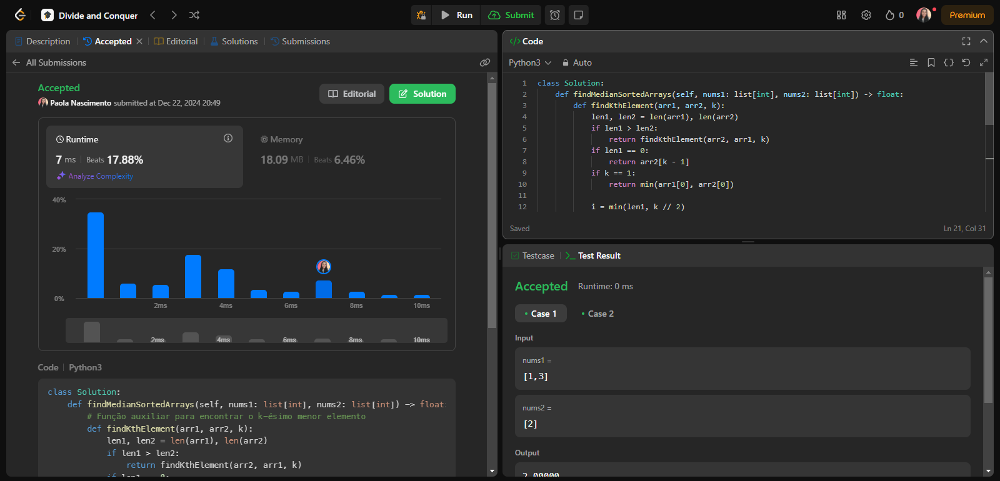
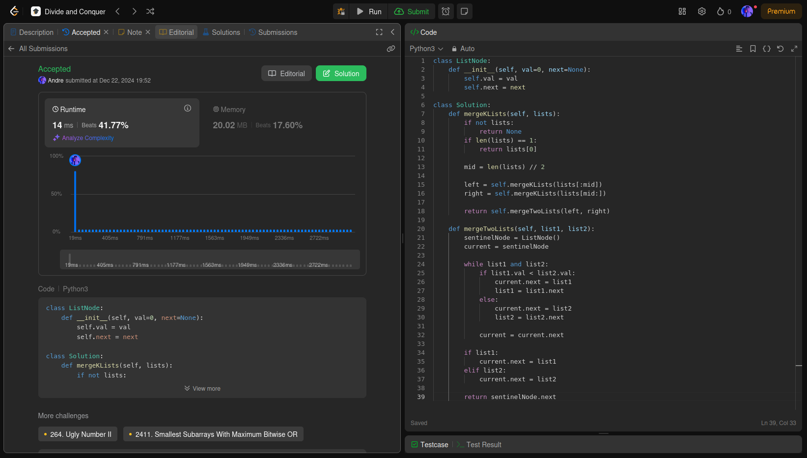
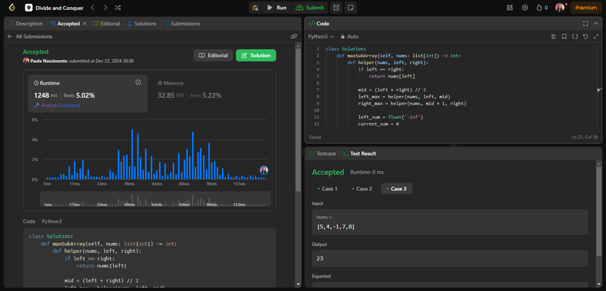
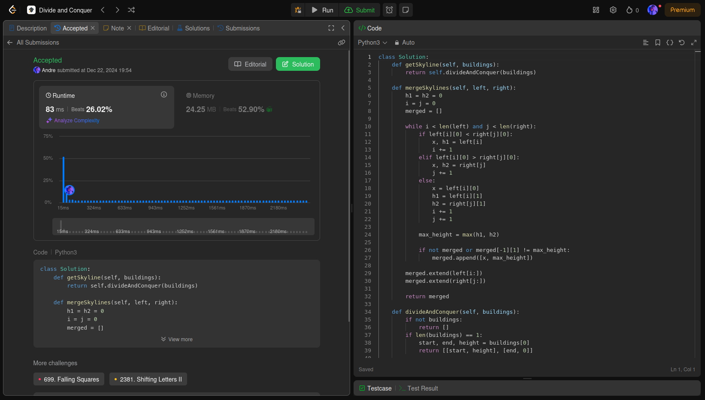

# D&C - LeetCode

**Número da Lista**: 3 
**Conteúdo da Disciplina**: Dividir e Conquistar 

## Alunos
|Matrícula | Aluno |
| -- | -- |
| 22/2037648   |  André Cláudio Maia da Cunha |
| 21/1062713 |  Paola Rebeca Lima do Nascimento  |

## Sobre 
Para este trabalho, a dupla irá realizar exercícios de programação do LeetCode, praticando algoritmos que sigam a intuição de Divisão e Conquista.

- [Problema 4](https://leetcode.com/problems/median-of-two-sorted-arrays/description/?envType=problem-list-v2&envId=divide-and-conquer)
- [Problema 23](https://leetcode.com/problems/merge-k-sorted-lists/description/?envType=problem-list-v2&envId=divide-and-conquer)
- [Problema 53](https://leetcode.com/problems/maximum-subarray/description/?envType=problem-list-v2&envId=divide-and-conquer)
- [Problema 218](https://leetcode.com/problems/the-skyline-problem/description/?envType=problem-list-v2&envId=divide-and-conquer)

## Screenshots

=======
### Problema 4

### Problema 23

### Problema 53

### Problema 218

## Instalação 
**Linguagem**: Python 3 

## Uso 
Copie o código da questão e cole no respectivo problema no LeetCode. Após isso, clique em "submit" para ver o Online Judge verificando se a solução é válida.

## Link do Vídeo

